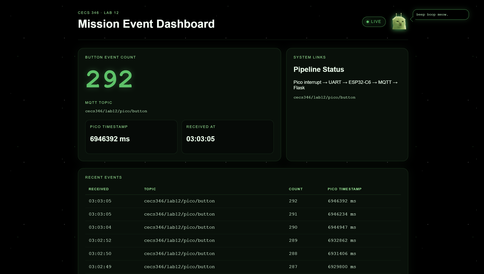

# Multi-Platform MQTT Dashboard

## What it Does

This project builds a simple multi-platform embedded system:

- A button press is detected on a **Raspberry Pi Pico**
- The Pico sends data over **UART** to an **ESP32-C6**
- The ESP32 publishes the data to an **MQTT broker**
- A **Flask dashboard** subscribes to the data and displays it in real time

## Sample Output



---

## Hardware Prerequisites

- Raspberry Pi Pico  
- ESP32-C6 Dev Board  
- Pushbutton  
- Jumper wires  
- Breadboard  

---

## Software Prerequisites

- VS Code + PlatformIO  
- Python 3  
- Flask (`pip install flask`)  
- Paho MQTT (`pip install paho-mqtt`)  
- Mosquitto MQTT Broker  

---

## Wiring

### Pico → ESP32 (UART)

| Pico | ESP32 |
|------|------|
| TX (GP0)   | RX (GPIO4) |
| GND  | GND |

> Both boards must share a common ground.

---

### Button Wiring (Pico)


GP15 → Button → GND


- Use internal pull-up (`INPUT_PULLUP`)

---

## Message Flow


Pico → UART → ESP32 → MQTT → Flask → Browser


---

## Running


```bash
./startup.sh
